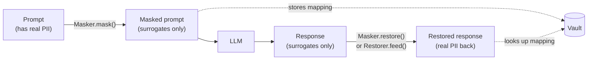
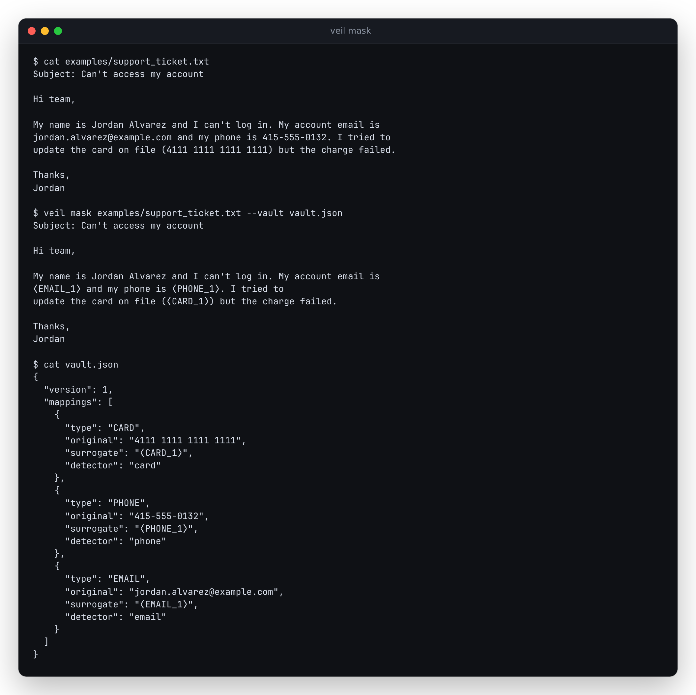

# veil

**Reversible PII masking for LLM calls.** Mask personal data before the
prompt leaves your network, let the model reason over consistent
surrogates, and restore the originals in the answer — streaming included.

[](LICENSE)
[](https://antonsoo.github.io/veil/)


**[Try the live demo →](https://antonsoo.github.io/veil/)** — runs the
real Python package in your browser via [Pyodide](https://pyodide.org),
nothing leaves the page. (`web/`; see [Web demo](#web-demo) below.)

## Why this exists

Teams in healthcare, legal, finance, and support want to use hosted LLMs,
but their prompts contain customer names, emails, phone numbers, card
numbers, account IDs, and API keys. The usual answer is "redact it" —
replace the value with `[REDACTED]`. That breaks the response: the model
can't say "Dear [REDACTED], your order [REDACTED] ships tomorrow."

Reversible pseudonymization fixes that instead: replace each sensitive
value with a consistent surrogate, let the model reason over the
surrogates, and map them back in the response. The model never sees the
real data; the human on the other end never sees a redaction. The part
almost nobody handles is doing that restoration on a *stream* of tokens,
where a surrogate can be split across chunk boundaries — that's most of
what this repository is about.

## How it works



1. **Detect.** Regex-and-validation detectors (Luhn, mod-97, structural
   checks) find emails, phone numbers, cards, IBANs, SSNs, IPs,
   credential-bearing URLs, API keys, and dates of birth. A pluggable
   backend finds names/orgs/locations — see "Names, orgs, and locations"
   under [Features](#features) below.
2. **Mask.** Each detected value gets a surrogate — either a placeholder
   token (`⟨EMAIL_1⟩`) or a realistic fake (`user1@example.com`) — and the
   `(original, surrogate)` pair is recorded in a `Vault`. The same
   original always maps to the same surrogate for the life of the vault.
3. **Send.** The masked text goes to the LLM. It never sees the real
   values.
4. **Restore.** The response comes back full of surrogates. `restore_exact`
   / `restore_tolerant` swap them back for a buffered response;
   `Restorer.feed()` does it token-by-token for a stream.

### The streaming problem, concretely

Say the vault maps `⟨EMAIL_1⟩` to `alice@example.com`, and the model
streams its reply in small chunks:

```
chunk 1: "Sure, I'll email ⟨EM"
chunk 2: "AIL_1⟩ right away."
```

A restorer that looks at each chunk in isolation emits `⟨EM` verbatim (the
placeholder leaks into what the user sees) and then has no memory of it
when `AIL_1⟩` arrives in the next chunk. `veil.restore.Restorer` instead
recognizes that `⟨EM` is a valid *prefix* of a known surrogate, holds back
only that trailing fragment, and completes the match once `AIL_1⟩`
arrives — emitting `alice@example.com right away.` with nothing leaked
and no extra latency beyond the one held-back fragment. It's built on a
trie over the vault's surrogate strings (see `veil/restore.py`), and
Hypothesis property tests prove that *any* way you split a given text
into chunks produces output identical to restoring it unsplit
(`tests/test_restore_streaming.py`).

## Quickstart

```bash
pip install "git+https://github.com/antonsoo/veil"
```

```python
from veil import Masker

masker = Masker()
masked = masker.mask("Email alice@example.com about invoice #4471.")
print(masked)  # "Email ⟨EMAIL_1⟩ about invoice #4471."

# ... send `masked` to your LLM of choice, get `reply` back ...
reply = "Sure, I've noted it for ⟨EMAIL_1⟩."
print(masker.restore(reply))  # "Sure, I've noted it for alice@example.com."
```

### With the Anthropic SDK

```python
from anthropic import Anthropic
from veil.integrations.anthropic import AnthropicVeil

client = AnthropicVeil(Anthropic())  # requires: pip install "veil-pii[anthropic]"

response = client.create(
    model="claude-opus-5",
    max_tokens=1024,
    messages=[{"role": "user", "content": "Email alice@example.com about invoice #4471."}],
)
print(response.content[0].text)  # the real address, restored — Claude only ever saw a surrogate

# Streaming:
with client.stream(model="claude-opus-5", max_tokens=1024, messages=[...]) as stream:
    for text in stream.text_stream:  # already restored, split-token-safe
        print(text, end="", flush=True)
```

`veil.integrations.openai.OpenAIVeil` is the same shape for the OpenAI SDK,
including restoring tool-call arguments as they stream in fragments.

## Features

- **Detectors** (`veil.detectors`): email, phone (E.164/NANP/international),
  payment card (Luhn + issuer ranges), IBAN (mod-97 + per-country length),
  US SSN (excluding never-issued ranges), IPv4/IPv6, credential-bearing
  URLs, API keys/secrets (`AKIA…`, `ghp_…`, `github_pat_…`, `xox…`,
  `sk_live_…`, `sk-ant-…`, `sk-…`, plus a Shannon-entropy heuristic),
  context-gated date-of-birth, and an opt-in US street-address heuristic.
- **Names, orgs, and locations** via a pluggable `NameBackend`: a
  first-class `KnownEntitiesBackend` (you already know the customer's name
  from your own database — this is the most reliable option in practice)
  and an optional `SpacyBackend`.
- **Surrogates**: placeholder tokens or realistic format-preserving fakes
  (fake names, `example.com`/`example.org` emails per RFC 2606, `555-01xx`
  NANP phone numbers, Luhn-valid test-range card numbers), consistent
  within a session.
- **Restore**: exact (byte-for-byte) and tolerant (case changes,
  possessives, a surrogate split across a line wrap) — see
  `veil/restore.py` for exactly what "tolerant" does and doesn't cover.
- **Streaming restore**: `Restorer.feed(chunk) -> str` / `.flush() -> str`,
  proven equal to non-streamed restore under arbitrary chunking.
- **Leak audit** (`veil.audit`): checks outgoing text for original values
  that should never reappear, and flags *new* PII the model introduced.
- **Vault**: in-memory by default, JSON-serializable, optional Fernet
  encryption at rest (`veil-pii[vault-crypto]`) — see the threat model in
  `veil/vault.py`.
- **CLI**: `veil mask`, `veil restore`, `veil audit`.
- **SDK integrations**: thin Anthropic and OpenAI wrappers.
- **Zero runtime dependencies in the core.** Everything above the
  detectors/surrogates/restore/vault/CLI layer is an optional extra.

## CLI

```bash
$ veil mask examples/support_ticket.txt --vault vault.json
Subject: Can't access my account
...
My account email is ⟨EMAIL_1⟩ and my phone is ⟨PHONE_1⟩. I tried to
update the card on file (⟨CARD_1⟩) but the charge failed.
...

$ veil restore masked_reply.txt --vault vault.json
$ veil audit outgoing_reply.txt --vault vault.json   # exit 1 if anything leaked
```



## Web demo

[antonsoo.github.io/veil](https://antonsoo.github.io/veil/) runs the
*actual* `veil` Python package in the browser via
[Pyodide](https://pyodide.org) (loaded from cdn.jsdelivr.net) — the
`web/scripts/copy-veil-src.mjs` build step bundles `src/veil`'s real
source (zero runtime dependencies makes this possible with no wheel
build) so the demo is never a JS reimplementation drifting from the
library. Paste a prompt, optionally list names your app already knows
(wired to `KnownEntitiesBackend`), mask it, and watch a simulated reply
stream back through the real `Restorer`, one random-sized chunk at a
time — dark mode:


Everything — Pyodide, the package source, the whole interaction — stays
in that browser tab; nothing is sent anywhere, which the page itself
says. Built with Vite + TypeScript in `web/`; `npm run dev` there for
local development.

## Measured results

Measured on this machine (14 vCPU WSL2 Linux, 48 GB RAM) by running
`scripts/evaluate.py` against `benchmarks/corpus.jsonl` — a 200-document,
5-category **synthetic** corpus generated by `scripts/generate_corpus.py`
with a fixed seed (reproduce with
`uv run python scripts/generate_corpus.py 40 > benchmarks/corpus.jsonl`).

| Detector | Precision | Recall | F1 |
|---|---|---|---|
| Address (heuristic) | 1.000 | 1.000 | 1.000 |
| Card | 1.000 | 1.000 | 1.000 |
| DOB | 1.000 | 1.000 | 1.000 |
| Email | 1.000 | 1.000 | 1.000 |
| IBAN | 1.000 | 1.000 | 1.000 |
| IPv4 | 1.000 | 1.000 | 1.000 |
| Phone | 1.000 | 1.000 | 1.000 |
| Secret | 1.000 | 1.000 | 1.000 |
| SSN | 1.000 | 1.000 | 1.000 |
| **Total** | **1.000** | **1.000** | **1.000** |

**Masking throughput:** ~1.6-2.0 MB/s (single-threaded, all nine
detectors run on every document; varies run to run — see `elapsed_s` in
the script's output).

**Streaming-restore overhead:** within roughly ±20% of non-streamed
restore at a 24-character chunk size, on the same corpus — noise-level on
this machine, not a meaningful cost.

**Read the "1.000" row honestly** — see [Accuracy and
limitations](#accuracy-and-limitations). This corpus was built to
independently verify each detector's *validated* claims (a real Luhn
check, a real mod-97 check, real NANP/E.164 structure, real never-issued
SSN ranges — see [How it works](#how-it-works)), so a clean score mostly
means those checks are implemented correctly, not that real-world text is
this easy. The corpus generator itself found and fixed five real
precision bugs during development (IPv4/phone/SSN/card ambiguity, two
regex boundary bugs) — see the git history for `fix: detector false
positives found via synthetic corpus evaluation`.

## Accuracy and limitations

- **Detection is never perfect.** Every regex-and-validation detector here
  has a documented failure mode in its own module docstring (e.g.
  `veil/detectors/phone.py` explains exactly which phone formats it
  deliberately won't match, and why). Read those before relying on this
  for a compliance-sensitive workload.
- **Names need a backend.** Out of the box, veil does not detect person,
  organization, or location names — those require
  `KnownEntitiesBackend` (recommended: you almost always already know the
  customer's identity) or an optional, *unbenchmarked* spaCy backend. See
  `veil/backends/spacy_backend.py` for why we don't claim an NER accuracy
  number we haven't measured.
  - **US-centric.** Phone (NANP), SSN, and the address heuristic assume
  US formats primarily; IBAN and E.164 phone cover international cases,
  but there's no general international address, national-ID, or
  VAT-number detector yet.
- **Realistic surrogates can leak structure.** A format-preserving fake
  IBAN still reveals the real one's country; a fake card still reveals
  its network. See the trade-off discussion in `veil/surrogates.py`.
- **The vault is the whole game.** Anyone who reads the vault can
  de-anonymize the masked text — see the threat model in `veil/vault.py`
  before deciding where (or whether) to persist one.
- **Synthetic benchmarks overstate real-world performance.** The corpus
  above is clean, well-formatted, English-language, and generated by the
  same kind of logic the detectors use to validate — it is a correctness
  check, not a claim about messy real-world text (typos, non-US formats,
  mixed languages, OCR noise).

## Development

```bash
git clone https://github.com/antonsoo/veil
cd veil
uv sync --group dev
uv run pytest          # 148 tests, including Hypothesis property tests
uv run ruff check .    # lint
uv run mypy            # typecheck (strict)
```

Correctness is checked against independent oracles where one exists: the
Luhn checksum for cards, ISO 7064 mod-97 for IBAN (verified against
published Wikipedia example IBANs for GB/DE/FR), and the stdlib
`ipaddress` module for IP parsing — see the module docstrings in
`veil/detectors/` for details, and `tests/` for the corresponding tests.

## Contributing

See [CONTRIBUTING.md](CONTRIBUTING.md).

## License

[MIT](LICENSE) © 2026 Anton Soloviev
