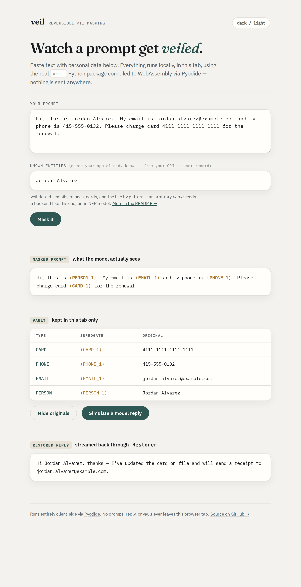
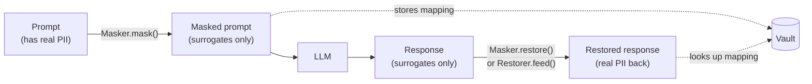
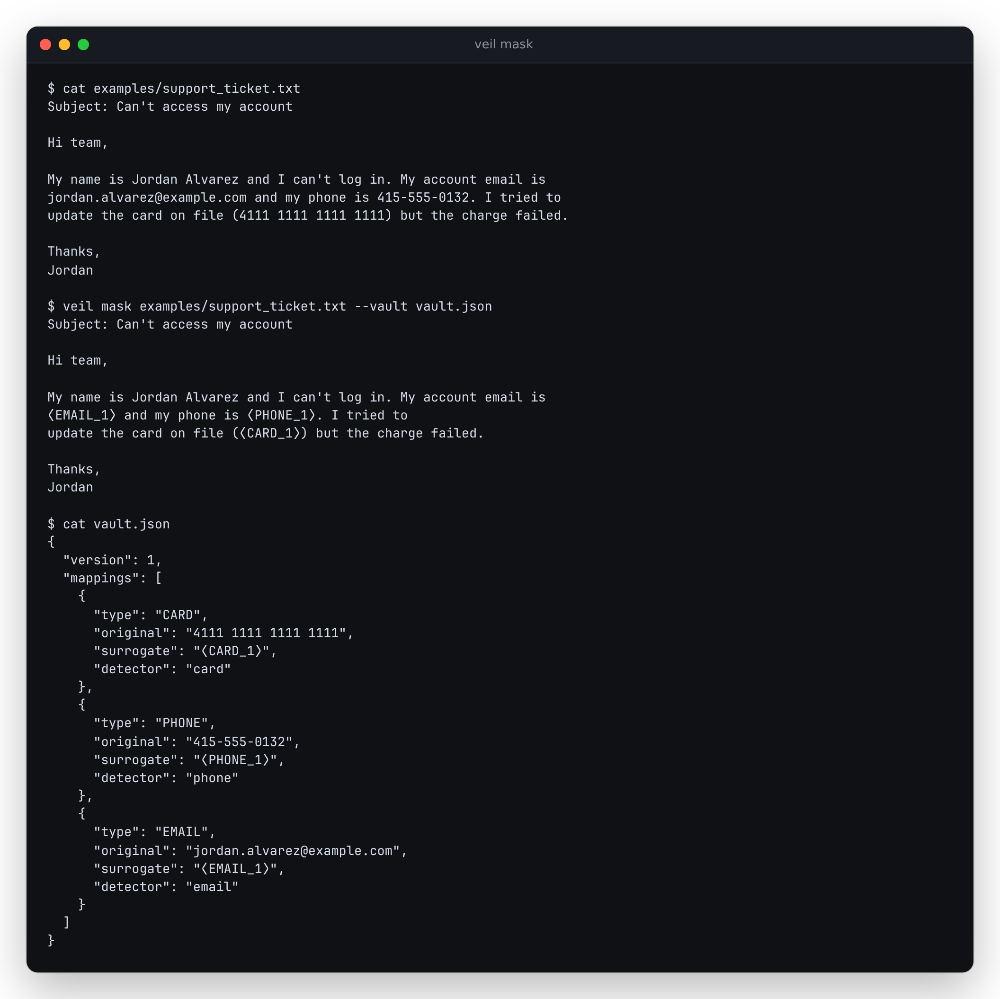
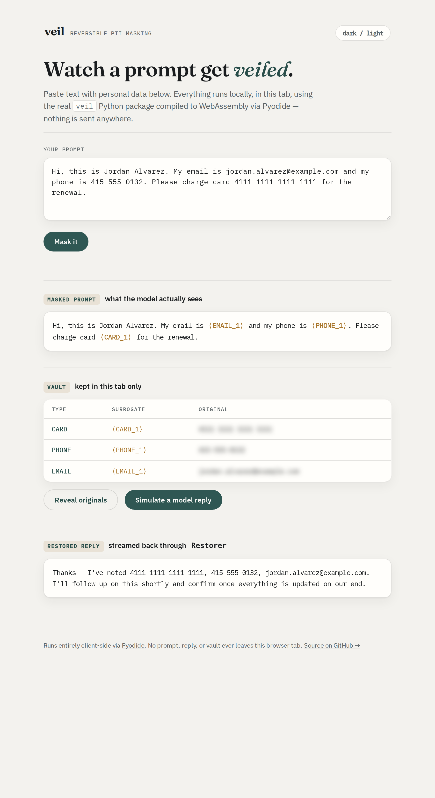

# veil

**Reversible PII masking for LLM calls.** Mask personal data before the
prompt leaves your network, let the model reason over consistent
surrogates, and restore the originals in the answer — streaming included.

[](https://pypi.org/project/veil-pii/)
[](LICENSE)
[](https://antonsoo.github.io/veil/)
[](https://huggingface.co/spaces/antonsoloviev/veil)



**[Try the live demo →](https://antonsoo.github.io/veil/)** — runs the
real Python package in your browser via [Pyodide](https://pyodide.org),
nothing leaves the page: its Content-Security-Policy lets it talk to its own
origin and to the CDN Pyodide is downloaded from, and to nothing else.
(`web/`; see [Web demo](#web-demo) below.)

## Why this exists

Teams in healthcare, legal, finance, and support want to use hosted LLMs,
but their prompts contain customer names, emails, phone numbers, card
numbers, account IDs, and API keys. The usual answer is "redact it" —
replace the value with `[REDACTED]`. That breaks the response: the model
can't say "Dear [REDACTED], your order [REDACTED] ships tomorrow."

Reversible pseudonymization fixes that instead: replace each sensitive
value with a consistent surrogate, let the model reason over the
surrogates, and map them back in the response. The model never sees the
real data; the human on the other end never sees a redaction. The part
almost nobody handles is doing that restoration on a *stream* of tokens,
where a surrogate can be split across chunk boundaries — that's most of
what this repository is about.

## How it works


```mermaid
flowchart LR
    A["Prompt\n(has real PII)"] -->|"Masker.mask()"| B["Masked prompt\n(surrogates only)"]
    B --> C["LLM"]
    C --> D["Response\n(surrogates only)"]
    D -->|"Masker.restore()\nor Restorer.feed()"| E["Restored response\n(real PII back)"]
    B -.->|"stores mapping"| V[("Vault")]
    E -.->|"looks up mapping"| V
```

1. **Detect.** Regex-and-validation detectors (Luhn, mod-97, structural
   checks) find emails, phone numbers, cards, IBANs, SSNs, IPs,
   credential-bearing URLs, API keys, and dates of birth. A pluggable
   backend finds names/orgs/locations — see "Names, orgs, and locations"
   under [Features](#features) below.
2. **Mask.** Each detected value gets a surrogate — either a placeholder
   token (`⟨EMAIL_1⟩`) or a realistic fake (`user1@example.com`) — and the
   `(original, surrogate)` pair is recorded in a `Vault`. The same
   original always maps to the same surrogate for the life of the vault.
3. **Send.** The masked text goes to the LLM. It never sees the real
   values.
4. **Restore.** The response comes back full of surrogates. `restore_exact`
   / `restore_tolerant` swap them back for a buffered response;
   `Restorer.feed()` does it token-by-token for a stream.

### The streaming problem, concretely

Say the vault maps `⟨EMAIL_1⟩` to `alice@example.com`, and the model
streams its reply in small chunks:

```
chunk 1: "Sure, I'll email ⟨EM"
chunk 2: "AIL_1⟩ right away."
```

A restorer that looks at each chunk in isolation emits `⟨EM` verbatim (the
placeholder leaks into what the user sees) and then has no memory of it
when `AIL_1⟩` arrives in the next chunk. `veil.restore.Restorer` instead
recognizes that `⟨EM` is a valid *prefix* of a known surrogate, holds back
only that trailing fragment, and completes the match once `AIL_1⟩`
arrives — emitting `alice@example.com right away.` with nothing leaked
and no extra latency beyond the one held-back fragment. It's built on a
trie over the vault's surrogate strings (see `veil/restore.py`), and
Hypothesis property tests prove that *any* way you split a given text
into chunks produces output identical to restoring it unsplit
(`tests/test_restore_streaming.py`).

## Quickstart

```bash
pip install veil-pii
```

```python
from veil import Masker

masker = Masker()
masked = masker.mask("Email alice@example.com about invoice #4471.")
print(masked)  # "Email ⟨EMAIL_1⟩ about invoice #4471."

# ... send `masked` to your LLM of choice, get `reply` back ...
reply = "Sure, I've noted it for ⟨EMAIL_1⟩."
print(masker.restore(reply))  # "Sure, I've noted it for alice@example.com."
```

### With the Anthropic SDK

```bash
pip install "veil-pii[anthropic]"
```

```python
from anthropic import Anthropic
from veil.integrations.anthropic import AnthropicVeil

client = AnthropicVeil(Anthropic())

response = client.create(
    model="claude-opus-5-5",
    max_tokens=1024,
    messages=[{"role": "user", "content": "Email alice@example.com about invoice #4471."}],
)
print(response.content[0].text)  # the real address, restored — Claude only ever saw a surrogate

# Streaming:
with client.stream(model="claude-opus-5-5", max_tokens=1024, messages=[...]) as stream:
    for text in stream.text_stream:  # already restored, split-token-safe
        print(text, end="", flush=True)
```

All three of the SDK's ways to stream come back restored: `stream.text_stream`,
iterating the stream's events (the API's deltas, and the SDK's own `text` and
`input_json` events and the snapshots on `content_block_stop` and
`message_stop`), and the raw event iterator of `create(..., stream=True)`.
Tool-input JSON is restored as its fragments arrive. Text held back because it
might begin a surrogate is released before its block's `content_block_stop`.
`AsyncAnthropicVeil` is the same wrapper for `AsyncAnthropic`:

```python
from anthropic import AsyncAnthropic
from veil.integrations.anthropic import AsyncAnthropicVeil

client = AsyncAnthropicVeil(AsyncAnthropic())
response = await client.create(model="claude-opus-5-5", max_tokens=1024, messages=[...])
async with client.stream(model="claude-opus-5-5", max_tokens=1024, messages=[...]) as stream:
    async for text in stream.text_stream:
        print(text, end="", flush=True)
```

### With the OpenAI SDK

`veil.integrations.openai.OpenAIVeil` (the `openai` extra) wraps both of
OpenAI's APIs: `create` / `stream` for Chat Completions, and
`create_response` / `stream_response` for the Responses API. Passing
`stream=True` to `create` or `create_response` streams the same way, restored.
`AsyncOpenAIVeil` is the same wrapper for `AsyncOpenAI` (`await` each call,
`async for` over a stream).

```python
from openai import OpenAI
from veil.integrations.openai import OpenAIVeil

client = OpenAIVeil(OpenAI())

response = client.create_response(
    model="gpt-6-sol",
    instructions="You draft customer emails.",
    input="Email alice@example.com about invoice #4471.",
)
print(response.output_text)  # restored; the model only saw ⟨EMAIL_1⟩

for event in client.stream_response(model="gpt-6-sol", input=[...]):
    if event.type == "response.output_text.delta":
        print(event.delta, end="", flush=True)  # restored, split-token-safe
```

For the Responses API, veil masks `instructions` and every message,
`function_call`, `function_call_output` and custom tool item in `input`. It
restores message text, refusals, tool-call arguments and reasoning summaries
in `output`, and `response.output_text` with them, since the SDK computes it
from `output`. Reasoning items pass through untouched. In a stream, text and
argument deltas are restored as they arrive, and any text held back because
it might begin a surrogate is released, as one more delta event, before the
matching `.done` event. With `previous_response_id` the server keeps the
masked history, so keep the same `OpenAIVeil` (and its vault) for the whole
conversation.

In a Chat Completions stream every choice has its own restorers (`n > 1`
choices arrive interleaved, and so do parallel tool calls), refusals are
restored like content, and held-back text is released in the chunk that
carries the choice's `finish_reason`, so nothing arrives after a choice has
finished or after the usage chunk.

**How the wrappers are tested.** There is no API key in this repository and
no live call. `tests/test_sdk_anthropic.py` and `tests/test_sdk_openai.py`
run the real SDKs (sync and async clients) over a mocked HTTP transport that
answers in the APIs' wire format, so the messages, chunks and events veil
restores there are the ones the SDK builds for an application; a property
test cuts a reply at arbitrary points and requires the same restored text.
The other integration tests use fakes shaped like the SDK types.

### Multi-turn conversations and tool calls

Keep your history the normal way: append the assistant turn veil handed
you (real values restored, including in the `tool_use` input your code is
about to execute) and send the whole list on the next call. The wrapper
remembers the exact blocks the model produced for everything it restored,
and swaps them back in before the request leaves, so:

- **No real value goes back to the provider.** Restored tool-call
  arguments are the easy thing to leak: they are real by design, because
  your code has to act on them.
- **The history the API sees never changes.** Re-masking a restored turn
  only approximates the original (a support address the model wrote
  itself looks like PII and would get a fresh surrogate). Any difference
  is an edit to an earlier turn: the prompt cache restarts from there, and
  on current Claude models every later thinking block's signature stops
  matching its conversation, which accounts that enforce the check reject
  with a 400. Thinking blocks are never masked or restored for the same
  reason.

A turn veil didn't produce (or one you edited) is masked like any other
message. OpenAI tool-call arguments arrive as a JSON string; veil parses
them before restoring, so a surrogate the model wrote with `\u27e8`-style
escapes is still found, and restored values are escaped so the arguments
stay valid JSON.

## Features

- **Detectors** (`veil.detectors`): email, phone (NANP, or international
  with an explicit `+` country code — no unprefixed generic fallback; see
  the module docstring for why),
  payment card (Luhn + issuer ranges), IBAN (mod-97 + per-country length),
  US SSN (excluding never-issued ranges), IPv4/IPv6 (a dotted quad labelled
  as a version is left alone), credential-bearing URLs of any scheme
  (including `postgres://`/`redis://`-style connection strings), PEM private
  key blocks, API keys/secrets (`AKIA…`, `ghp_…`, `github_pat_…`, `xox…`,
  `sk_live_…`, `sk-ant-…`, `sk-…`, plus a Shannon-entropy heuristic),
  context-gated date-of-birth, and an opt-in US street-address heuristic.
- **Names, orgs, and locations** via a pluggable `NameBackend`: a
  first-class `KnownEntitiesBackend` (you already know the customer's name
  from your own database — this is the most reliable option in practice)
  and an optional `SpacyBackend`.
- **Surrogates**: placeholder tokens or realistic format-preserving fakes
  (fake names, `example.com`/`example.org` emails per RFC 2606, `555-01xx`
  NANP phone numbers, Luhn-valid test-range card numbers), consistent
  within a session.
- **Restore**: exact (byte-for-byte) and tolerant (case changes,
  possessives, a surrogate split across a line wrap) — see
  `veil/restore.py` for exactly what "tolerant" does and doesn't cover.
- **Streaming restore**: `Restorer.feed(chunk) -> str` / `.flush() -> str`,
  proven equal to non-streamed restore under arbitrary chunking.
- **Leak audit** (`veil.audit`): checks outgoing text for original values
  that should never reappear, and flags *new* PII the model introduced.
- **Vault**: in-memory by default, JSON-serializable, optional Fernet
  encryption at rest (`veil-pii[vault-crypto]`) — see the threat model in
  `veil/vault.py`.
- **CLI**: `veil mask`, `veil restore`, `veil audit`.
- **SDK integrations**: thin wrappers for the Anthropic Messages API and
  OpenAI's Chat Completions and Responses APIs, for sync and async clients,
  that mask every outgoing message (tool calls included), restore responses
  and every way of streaming them, and replay earlier assistant turns exactly
  as the model produced them.
- **Zero runtime dependencies in the core.** Everything above the
  detectors/surrogates/restore/vault/CLI layer is an optional extra.

## CLI

```bash
$ veil mask examples/support_ticket.txt --vault vault.json --name "Jordan Alvarez" --name Jordan
Subject: Can't access my account

Hi team,

My name is ⟨PERSON_1⟩ and I can't log in. My account email is
⟨EMAIL_1⟩ and my phone is ⟨PHONE_1⟩. I tried to
update the card on file (⟨CARD_1⟩) but the charge failed.

Thanks,
⟨PERSON_2⟩

$ veil restore masked_reply.txt --vault vault.json
$ veil audit outgoing_reply.txt --vault vault.json   # exit 1 if anything leaked
```

An email address or a card number has a shape; a name has none, so the names
are yours to give: `--name`, `--org` and `--location` (each repeatable), or
`--names-file` with one per line. Without them the ticket above keeps "Jordan
Alvarez" in it.

Each command reads stdin when no file is named and writes stdout, so they sit
on either side of a model call; `-o FILE` writes a file instead:

```bash
$ cat ticket.txt | veil mask --vault vault.json | your-llm-call | veil restore --vault vault.json
$ veil mask ticket.txt --vault vault.json -o masked.txt
```

Input and output are UTF-8 on every path, pipes included, whatever the
system's code page; line endings pass through unchanged. In Windows
PowerShell, prefer `-o` to `>`, which re-encodes what a program prints.



## Web demo

[antonsoo.github.io/veil](https://antonsoo.github.io/veil/) runs the
*actual* `veil` Python package in the browser via
[Pyodide](https://pyodide.org) (loaded from cdn.jsdelivr.net) — the
`web/scripts/copy-veil-src.mjs` build step bundles `src/veil`'s real
source (zero runtime dependencies makes this possible with no wheel
build) so the demo is never a JS reimplementation drifting from the
library. Paste a prompt, optionally list names your app already knows
(wired to `KnownEntitiesBackend`), mask it, and watch a simulated reply
stream back through the real `Restorer`, one random-sized chunk at a
time — dark mode:



Everything — Pyodide, the package source, the whole interaction — stays
in that browser tab; nothing is sent anywhere, which the page itself
says. Built with Vite + TypeScript in `web/`; `npm run dev` there for
local development.

## Measured results

Measured on this machine (14 vCPU WSL2 Linux, 48 GB RAM) by running
`scripts/evaluate.py` against `benchmarks/corpus.jsonl` — a 240-document,
6-category **synthetic** corpus generated by `scripts/generate_corpus.py`
with a fixed seed (reproduce with
`uv run python scripts/generate_corpus.py 40 > benchmarks/corpus.jsonl`).

| Detector | Precision | Recall | F1 |
|---|---|---|---|
| Address (heuristic) | 1.000 | 1.000 | 1.000 |
| Card | 1.000 | 1.000 | 1.000 |
| DOB | 1.000 | 1.000 | 1.000 |
| Email | 1.000 | 1.000 | 1.000 |
| IBAN | 1.000 | 1.000 | 1.000 |
| IPv4 | 1.000 | 1.000 | 1.000 |
| Phone | 1.000 | 1.000 | 1.000 |
| Secret | 1.000 | 1.000 | 1.000 |
| SSN | 1.000 | 1.000 | 1.000 |
| **Total** | **1.000** | **1.000** | **1.000** |

**Benign false positives: 0.00 per 1,000 words**, measured over the
corpus's `clean_negative` and `benign_numbers` categories (80 documents,
4,155 words of ordinary business text with zero PII, deliberately
saturated with the numeric shapes that most look like phone numbers or
SSNs: ISO/DMY dates, times, `#order-1234` and `INV-`/ticket IDs, ZIP+4,
carrier tracking numbers, prices, room numbers, and version/build
strings — the exact categories a naive digit-group detector over-masks).
0.00 here means specifically "no false positive on *these* known-tricky
shapes", not "no false positives on arbitrary text" — see below.

**Masking throughput:** ~1.6-2.1 MB/s (single-threaded, all nine
detectors run on every document; varies run to run — see `elapsed_s` in
the script's output). Time grows in step with the input: a 270 KB export
holding 16,000 values masks in 0.65 s and restores in 0.22 s, and
`tests/test_scale.py` keeps it that way.

**Streaming-restore overhead:** within roughly ±20% of non-streamed
restore at a 24-character chunk size, on the same corpus — noise-level on
this machine, not a meaningful cost.

**Read the "1.000" row honestly** — see [Accuracy and
limitations](#accuracy-and-limitations). This corpus was built to
independently verify each detector's *validated* claims (a real Luhn
check, a real mod-97 check, real NANP/E.164 structure, real never-issued
SSN ranges — see [How it works](#how-it-works)), so a clean score mostly
means those checks are implemented correctly, not that real-world text is
this easy. The corpus generator and the benign-numbers check both found
and fixed real precision bugs during development — most recently the
phone detector masking an ISO date and an order number as phone numbers
in ordinary support text, and the SSN detector matching a ZIP+4 code
(`22156-7224` parses as area+group+serial if separators aren't required
to be consistent). See the git history for `fix: detector false
positives found via synthetic corpus evaluation` and the phone/SSN
over-masking fix that followed it.

## Accuracy and limitations

- **Detection is never perfect.** Every regex-and-validation detector here
  has a documented failure mode in its own module docstring (e.g.
  `veil/detectors/phone.py` explains exactly which phone formats it
  deliberately won't match, and why). Read those before relying on this
  for a compliance-sensitive workload.
- **Names need a backend.** Out of the box, veil does not detect person,
  organization, or location names — those require
  `KnownEntitiesBackend` (recommended: you almost always already know the
  customer's identity) or an optional, *unbenchmarked* spaCy backend. See
  `veil/backends/spacy_backend.py` for why we don't claim an NER accuracy
  number we haven't measured.
- **The SDK wrappers cover the calls they name.** `create` and `stream`
  (Messages, Chat Completions) and `create_response` / `stream_response`
  (Responses), on sync and async clients. The SDKs' other entry points
  (`client.chat.completions.stream()`, `client.responses.stream()`,
  `.parse()`, batches, `count_tokens`) are not wrapped: called on the
  underlying client they send what you pass, unmasked. A model's thinking
  text is passed through as it was signed, so it shows surrogates, not the
  originals.
- **US-centric.** Phone (NANP), SSN, and the address heuristic assume
  US formats primarily; IBAN and E.164 phone cover international cases,
  but there's no general international address, national-ID, or
  VAT-number detector yet.
- **Realistic surrogates can leak structure.** A format-preserving fake
  IBAN still reveals the real one's country; a fake card still reveals
  its network. See the trade-off discussion in `veil/surrogates.py`.
- **The vault is the whole game.** Anyone who reads the vault can
  de-anonymize the masked text — see the threat model in `veil/vault.py`
  before deciding where (or whether) to persist one.
- **Synthetic benchmarks overstate real-world performance.** The corpus
  above is clean, well-formatted, English-language, and generated by the
  same kind of logic the detectors use to validate — it is a correctness
  check, not a claim about messy real-world text (typos, non-US formats,
  mixed languages, OCR noise).

## Development

```bash
git clone https://github.com/antonsoo/veil
cd veil
uv sync --group dev
uv run pytest          # including Hypothesis property tests
uv run ruff check .    # lint
uv run mypy            # typecheck (strict)
```

Correctness is checked against independent oracles where one exists: the
Luhn checksum for cards, ISO 7064 mod-97 for IBAN (verified against
published Wikipedia example IBANs for GB/DE/FR), and the stdlib
`ipaddress` module for IP parsing — see the module docstrings in
`veil/detectors/` for details, and `tests/` for the corresponding tests.

## Contributing

See [CONTRIBUTING.md](CONTRIBUTING.md).

## License

[MIT](LICENSE) © 2026 Anton Soloviev

---

<sub>Part of [Officina](https://antonsoo.github.io/officina/), a set of small open-source tools by [Anton Soloviev](https://github.com/antonsoo).</sub>
